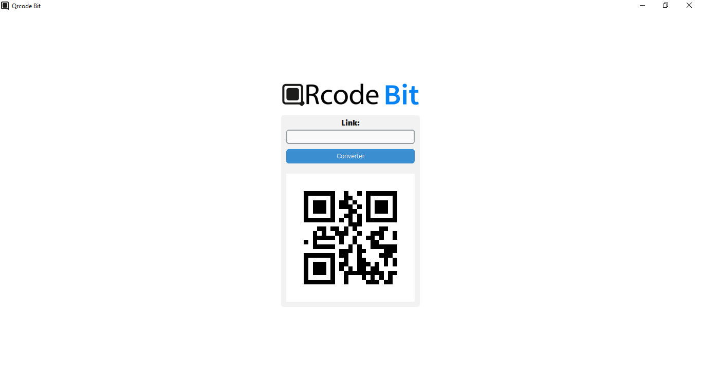
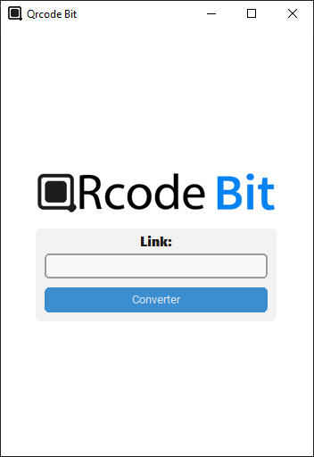

# Qrcode Bit
 

<!---->

  <figure>
   
    <figcaption>Aba/Interface do Qrcode Bit Maximizado</figcaption>
  </figure>

  <h3>Sobre o projeto</h3>
  
O QRcode Bit é um aplicativo conversor com interface simples e elegante capaz de converter textos/links em qrcode de forma rápida e prática, criado através da linguagem python, utilizando a biblioteca CustomTkinter.

  

    
    
   
  
  
   
   

  

  <h3>Resultado</h3>
  
   
  

 

